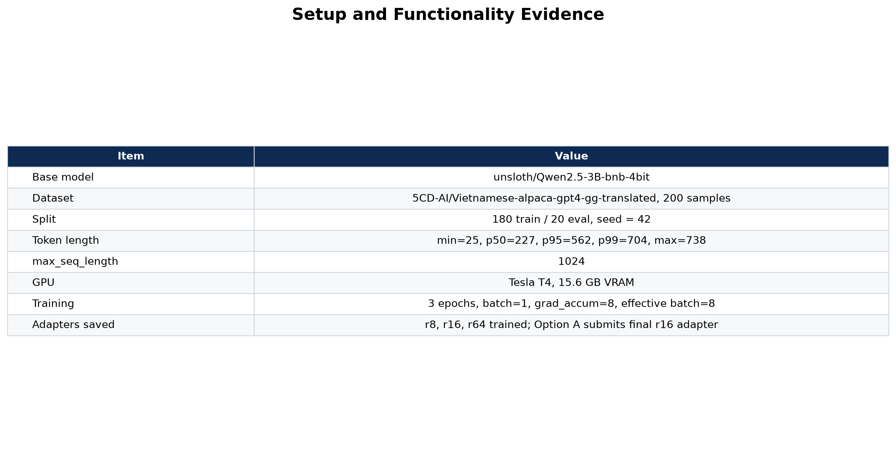
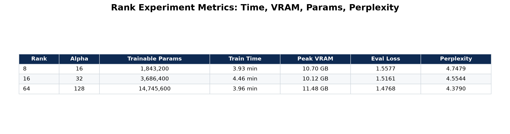
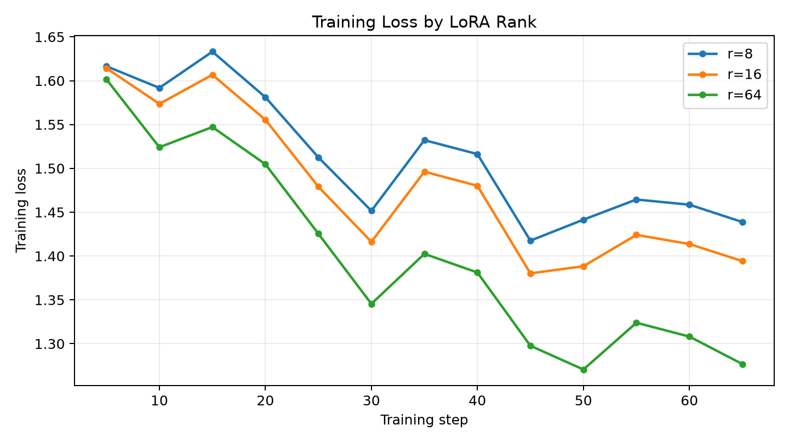
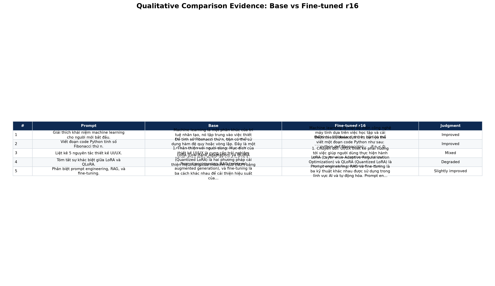
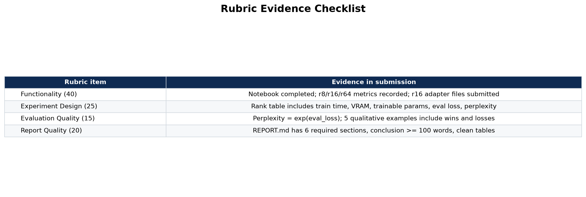

# Lab 21 - Evaluation Report

**Học viên**: Vũ Văn Huy - 2A202600750  
**Ngày nộp**: 2026-06-25  
**Submission option**: A - Lightweight ZIP  

## 1. Setup

- **Base model**: `unsloth/Qwen2.5-3B-bnb-4bit`
- **Fine-tuning method**: QLoRA 4-bit + LoRA adapters, `target_modules=["q_proj", "v_proj"]`
- **Dataset**: `5CD-AI/Vietnamese-alpaca-gpt4-gg-translated`
- **Dataset size**: 200 samples, split 90/10 thành 180 train và 20 eval
- **Token length analysis**: min = 25, max = 738, p50 = 227, p95 = 562, p99 = 704
- **max_seq_length**: 1024, rounded/capped from p95 for T4 profile
- **GPU**: Tesla T4, 15.6 GB VRAM
- **Training setup**: 3 epochs, batch size = 1, gradient accumulation = 8, effective batch size = 8
- **Optimizer / schedule**: `adamw_8bit`, learning rate = 2e-4, cosine schedule, warmup ratio = 0.10
- **Estimated training cost**: $0.07, based on total training time 12.3 minutes at $0.35/hour

## 2. Rank Experiment Results

| Rank | Alpha | Trainable Params | Train Time | Peak VRAM | Eval Loss | Perplexity |
|---:|---:|---:|---:|---:|---:|---:|
| 8 | 16 | 1,843,200 | 3.93 min | 10.70 GB | 1.5577 | 4.7479 |
| 16 | 32 | 3,686,400 | 4.46 min | 10.12 GB | 1.5161 | 4.5544 |
| 64 | 128 | 14,745,600 | 3.96 min | 11.48 GB | 1.4768 | 4.3790 |

The quantitative result shows a consistent improvement in eval loss and perplexity when increasing rank. Rank 64 achieved the best perplexity, but it used 4x more trainable parameters than rank 16 and 8x more than rank 8. The improvement from r=16 to r=64 was real but relatively small: perplexity improved from 4.5544 to 4.3790. For this small 200-sample dataset, r=64 did not take much longer than r=16, but it did require the highest peak VRAM.

## 3. Loss Curve Analysis

The T4 notebook disabled eval-during-training to reduce VRAM pressure, so the curve above uses training loss only. Across all three ranks, training loss generally decreased over time, with normal small fluctuations between logging steps. Rank 64 reached the lowest training loss near the end, which matches its best eval perplexity. Rank 16 also improved clearly and stayed close to r=64 on eval perplexity, while rank 8 had the weakest final eval result.

There is no strong evidence of overfitting from the available metrics. A stronger overfitting signal would require eval loss at multiple training steps, but in this run only final eval loss was computed. Since final eval loss also improved as training capacity increased, the result suggests the adapters learned useful patterns from the dataset rather than only memorizing the train split.

## 4. Qualitative Comparison

### Example 1

**Prompt**: Giải thích khái niệm machine learning cho người mới bắt đầu.

**Base**: Machine learning là một phân khúc của trí tuệ nhân tạo, tập trung vào việc thiết lập các mô hình máy móc để học từ dữ liệu và dự đoán hoặc hành động.

**Fine-tuned r=16**: Machine learning là một bộ môn công nghệ máy tính dựa trên việc học và cải thiện các dự đoán dựa trên dữ liệu mà không có sự hướng dẫn trực tiếp từ người dùng.

**Nhận xét**: Improved. Fine-tuned output giải thích gần với định nghĩa machine learning hơn và dễ đọc hơn.

### Example 2

**Prompt**: Viết đoạn code Python tính số Fibonacci thứ n.

**Base**: Đưa ra hướng tiếp cận đệ quy, nhưng đoạn output bị cắt và có khả năng kém tối ưu.

**Fine-tuned r=16**: Đưa ra hàm `fibonacci(n)` xử lý `n < 0`, `n == 0`, `n == 1`, sau đó dùng vòng lặp với biến `a, b`.

**Nhận xét**: Improved. Fine-tuned output chọn cách lặp, ổn định và thực tế hơn so với đệ quy đơn giản.

### Example 3

**Prompt**: Liệt kê 5 nguyên tắc thiết kế UI/UX.

**Base**: Nêu các ý như thân thiện với người dùng, bố cục, màu sắc, font chữ và trải nghiệm dễ sử dụng.

**Fine-tuned r=16**: Liệt kê các ý chuyển đổi, thích ứng, đơn giản, tương thích, nhưng một số ý diễn đạt chưa thật tự nhiên.

**Nhận xét**: Mixed. Fine-tuned output ngắn gọn hơn, nhưng base output có vẻ đúng ngữ cảnh UI/UX hơn.

### Example 4

**Prompt**: Tóm tắt sự khác biệt giữa LoRA và QLoRA.

**Base**: Gọi đúng LoRA là Low-Rank Adaptation và QLoRA là Quantized LoRA, nhưng phần giải thích còn chung chung.

**Fine-tuned r=16**: Gọi sai LoRA thành "Layer-wise Adaptive Regularization Optimization", dẫn tới sai khái niệm.

**Nhận xét**: Degraded. Đây là case loss quan trọng: fine-tuned model có thể tạo câu trả lời nghe tự tin nhưng sai factual.

### Example 5

**Prompt**: Phân biệt prompt engineering, RAG, và fine-tuning.

**Base**: Giải thích ba kỹ thuật theo hướng cải thiện hiệu suất mô hình, nhưng output bị cắt ở cuối.

**Fine-tuned r=16**: Giải thích prompt engineering là xây dựng câu lệnh, RAG và fine-tuning là các kỹ thuật khác nhau trong AI.

**Nhận xét**: Slightly improved. Fine-tuned output có cấu trúc tốt hơn, nhưng vẫn cần nói rõ hơn rằng RAG dùng retrieval cho knowledge và fine-tuning phù hợp style/format.

## 5. Conclusion về Rank Trade-off

Trong thí nghiệm này, rank 64 cho kết quả quantitative tốt nhất với eval loss = 1.4768 và perplexity = 4.3790. Tuy nhiên, rank 64 có 14.7M trainable parameters, gấp 4 lần so với rank 16 và 8 lần so với rank 8. Nếu chỉ nhìn chất lượng eval, r=64 là adapter tốt nhất. Nếu cần cân bằng giữa chất lượng, VRAM và kích thước adapter, r=16 là lựa chọn hợp lý hơn: perplexity 4.5544 chỉ kém r=64 một khoảng nhỏ, trong khi số tham số ít hơn nhiều. Rank 8 phù hợp khi tài nguyên rất hạn chế, nhưng trong run này perplexity cao nhất nên khả năng học style/format yếu hơn. Nếu deploy production cho một task nhỏ và cần chi phí thấp, tôi sẽ chọn r=16. Nếu mục tiêu ưu tiên chất lượng offline và GPU đủ thoải mái, r=64 có thể đáng chọn. Ngoài ra, qualitative evaluation cho thấy perplexity tốt hơn không đảm bảo mọi câu trả lời đều đúng factual, vì r=16 vẫn sai ở câu LoRA/QLoRA.

## 6. What I Learned

- LoRA rank tăng capacity của adapter, nhưng lợi ích không tăng tuyến tính với số parameters; cần nhìn cả perplexity, VRAM và qualitative output.
- QLoRA 4-bit giúp fine-tune model 3B trên Tesla T4 khá gọn, chỉ cần khoảng 10-12 GB VRAM trong thí nghiệm này.
- Evaluation không nên chỉ dựa vào một metric. Perplexity hữu ích để so sánh rank, nhưng qualitative prompts giúp phát hiện lỗi factual và output bị cắt.
